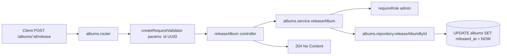

## UC00012 – Backend what’s-new feed v1 (join core)

---
 title: UC00012 – Backend what’s-new feed v1 (join core)
 status: planned
---

## Use case

**UC00012 – Get "what’s new" feed of latest releases.**  
A logged-in user opens the home or "What’s new" screen. The backend returns a feed of recently released albums (and, later, podcast episodes) **only for artists or podcasts that the user has liked**.

**User flow (end-to-end)**

1. User likes artists and/or podcasts in the app (e.g. taps Like on an artistor podcast). Likes are stored in the shared `likes` table.
2. Later, the same user opens the "What’s new" section (e.g. home → What’s new).
3. Client calls `GET /me/feed/releases?event_type=release_album,release_episode&days=60&limit=10&cursor=` (or with cursor for pagination).
4. Backend reads the user’s rows from `likes`, filters to the relevant entity types (for music: liked artists; later: liked podcasts/shows), joins those likes with catalog tables, and finds recent releases for those liked entities only.
5. Backend sorts releases by release date (newest first), caps by limit, and returns a unified list of feed items.
6. Client renders a personalized "What’s new" feed: **only new releases from artists/podcasts the user already likes**, not from the entire catalog.


## UC00013 – POST album release (write path)

**UC00013 – Mark an album as released.**  
Admin/dev uses `POST /albums/:id/release` to set `albums.released_at = NOW()`. The feed (UC00012) reads from `albums.released_at` to show recent releases.

**Specification**

- **Endpoint**: `POST /albums/:id/release` (v1)
- **Access**: dev/admin (requires admin role)
- **Query/Body**: None
- **Responses**: 204 No Content (success), 400 (invalid UUID), 404 (album not found), 401/403 (unauthorized / not admin)

**Implementation flow**



1. **Repository**: Add `releaseAlbumById(albumId: string): Promise<boolean>` – `UPDATE albums SET released_at = NOW() WHERE id = ? AND deleted_at IS NULL`; return `true` if updated, `false` if not found.
2. **Service**: `releaseAlbum(albumId)` – `requireRole(['admin'])`, call repo, throw `NotFoundError` if `false`.
3. **Controller**: Extract `albumId`, call service, `res.status(204).end()`.
4. **Router**: `POST /:id/release` with `createRequestValidator({ params: albumParamsSchema })`.
5. **Params schema**: `z.object({ id: z.uuid("Invalid album ID format") })` (or `albumId` per router param name).
6. **Wire**: `app.use("/albums", albumsRouter)`.

**Files to create/modify**: `catalog/albums/types/albums.params.schema.ts`, `albums.repository.ts`, `albums.service.ts`, `albums.controller.ts`, `albums.router.ts`, `albums/index.ts`, `app.ts`.


## HLD: Architecture

- **API**: read-only.  
  `GET /me/feed/releases` returns a list of latest releases for entities the user liked. There is **no worker and no projection tables** in v1; we read directly from core catalog tables plus the shared `likes` table.

- **Versioning and scope**
  - This is **v1 join-core**: designed for a monolith where DB joins over core tables are acceptable.
  - v1 implements **`event_type=release_album`** (music releases from liked artists).
  - `release_episode` is reserved for a later iteration backed by podcast tables; today we return a controlled error (`400` or `501`) if requested alone.

- **Data source**
  - For **music**:
    - Start from the current user’s likes in `likes` with `entity_type = 'artist'`.
    - Join liked artists to their albums via `album_artists` and `albums`.
    - Filter albums by release window and soft-delete.
  - For **podcasts** (later):
    - Start from user likes in `likes` for podcast-related entity types.
    - Join liked podcasts/shows to episodes via podcast tables.

- **Output model**
  - Unified, abstract feed item representing either a music release (album/single/compilation) or a podcast episode.
  - v1 uses only the music side but keeps the model ready for episodes.


## HLD: API endpoint – read path & flow

- **Method**: `GET`
- **Path**: `/me/feed/releases`
- **Description**: Return a personalized "what’s new" feed of latest releases (music or podcasts) for entities the user liked.

**Query params**

- **`event_type`** – array of strings, **optional** filter.
  - Allowed values: `"release_album"`, `"release_episode"`.
  - Default: when omitted, return both types (v1 effectively = `release_album` only; later: both).
  - When provided: filter to the given event types (e.g. `event_type=release_album,release_episode`).
  - v1: only `release_album` is implemented; `release_episode` alone returns `400` or `501`.
- **`days`** – number, **optional**, look-back window in days.
  - Default: `60`
  - Min: `1`
  - Max: `90`
  - Used as: `released_at >= CURDATE() - INTERVAL days DAY` (or equivalent for episodes).
- **`limit`** – number, **optional**, max number of items to return.
  - Default: `10`
  - Min: `1`
  - Max: `150`
  - Paging: uses `limit` with cursor (no offset).
- **`cursor`** – string, **optional** (v1 pagination).
  - Default: `""` (empty string).
  - Base64 encoding of `(releaseDate, releasedObjectId)` where `releaseDate` is the event/release date (ISO) and `releasedObjectId` is the album id or episode id (UUID).
  - Used to fetch feeds **before** a specific (release date, object id); sort is by release date, then by object id.

**Behavior**

- Sort is always **newest first** by release date (`occurredAt`), then by released object id (album id or episode id).
- Paging: no offset; use `cursor` + `limit` to take feeds before a specific (release date, object id).

**Responses**

- `200 OK` with body in **Output model** below.
- `400 Bad Request` if invalid query (bad `event_type`, `days`/`limit` out of range, non-numeric) or invalid UUID where applicable.
- `401 Unauthorized` if user is not authenticated (same auth as other `/me/*` endpoints).
- `500 Internal Server Error` on unexpected DB/server errors.
- Optionally `501 Not Implemented` for `event_type=release_episode` until we add podcast support.


## HLD: Output model (Activity Streams style)

**Top-level**

```ts
interface ReleaseFeedOutput {
  items: ReleaseFeedItem[];
  nextCursor?: string;   // for cursor-based pagination; paging uses cursor + limit, not offset
}
```

**Feed item (actor-verb-object)**

```ts
interface ReleaseFeedItem {
  feedActors: ReleaseFeedActor[];   // who performed the action (artists or show)
  feedVerb: ReleaseFeedVerb;        // the action they performed
  feedObject: ReleaseFeedObject;    // the thing that was created/updated
  occurredAt: string;               // event time (ISO datetime)
}

type ReleaseFeedVerb = "released";

interface ReleaseFeedActor {
  type: "artist" | "show";
  id: string;
  name: string;
}

interface ReleaseFeedObject {
  type: "album" | "episode";
  id: string;
  title: string;
  imageUrl: string;
  episodeDurationMs?: number;       // only when type === "episode"
  albumType?: "album" | "single" | "compilation";  // only when type === "album"
}
```

- **Sort order**: always **newest first** by release date (`occurredAt`), then by released object id (album id or episode id).
- **Pagination** (v1): cursor encodes `(releaseDate, releasedObjectId)`. Use `cursor` + `limit` to fetch feeds before that boundary. `nextCursor` encodes the next page boundary.


## HLD: Database – tables and queries

**Existing tables used** (from `serverWorkspace/REAME/scripts/db_schema.md`):

- `likes`
  - `id CHAR(36) PRIMARY KEY`
  - `user_id CHAR(36) NOT NULL`
  - `entity_type VARCHAR(32) NOT NULL` – e.g. 'artist', 'album', 'playlist', later 'podcast'
  - `entity_id CHAR(36) NOT NULL`
  - `created_at TIMESTAMP`
  - `deleted_at TIMESTAMP NULL`
  - Unique per `(user_id, entity_type, entity_id)`.
- `artists`
- `albums`
- `album_artists`

**Query pattern for `event_type=release_album` (liked artists only)**

1. Start from user likes for artists:

```sql
FROM likes l
WHERE
  l.user_id = ? AND
  l.entity_type = 'artist' AND
  l.deleted_at IS NULL
```

2. Join liked artists to their albums and artist metadata:

```sql
JOIN album_artists aa
  ON aa.artist_id = l.entity_id
JOIN albums a
  ON a.id = aa.album_id
JOIN artists ar
  ON ar.id = l.entity_id
```

3. Filter for non-deleted, recent releases:

```sql
WHERE
  a.deleted_at IS NULL
  AND ar.deleted_at IS NULL
  AND a.released_at >= CURDATE() - INTERVAL ? DAY
```

4. Sort and limit (cursor: when provided, add `WHERE (a.released_at, a.id) < (cursorReleaseDate, cursorObjectId)` before ORDER BY):

```sql
ORDER BY a.released_at DESC, a.id ASC
LIMIT ?
```

5. The join returns one row per `(album, artist)` pair; repository groups rows by album id and maps to `ReleaseFeedItem`:
   - `feedActors`: artist rows with `type = "artist"`, `id`, `name`
   - `feedVerb`: `"released"`
   - `feedObject`: album id, title, imageUrl, `type = "album"`, `albumType` from `albums.album_type`
   - `occurredAt`: album `released_at` as ISO datetime

**Indexes**

- Reuse existing:
  - `idx_likes_user` on `likes(user_id)`
  - `idx_likes_entity` on `likes(entity_type, entity_id)`
  - `idx_album_artists_artist` and `idx_album_artists_album`
- Optional future index on `albums(released_at)` if data grows; for this sample scale, a full scan over recent albums is acceptable.


## HLD: Read flow (backend)

1. **Validate query params**
   - Use Zod (or similar) schema in `types` to parse and validate `event_type`, `days`, `limit`, `cursor`.
   - Apply defaults and clamp values to min/max bounds.
   - Reject unsupported `event_type` with a clear error code and message.

2. **Router → controller → service**
   - Router:
     - Mounted under `/me`.
     - Attaches auth middleware (ensures `userId` is available).
     - Routes to `GET /me/feed/releases`.
   - Controller:
     - Reads query params.
     - Reads `userId` from auth context.
     - Calls service with `{ userId, eventType, days, limit, cursor }`.

3. **Service**
   - Branch by `eventType`:
     - `release_album`: call repository `getLatestReleaseFeedForUser`.
     - `release_episode`: for now throw typed `NotImplemented` / `BadRequest`.
     - both or omitted: call repository for supported types (v1 = release_album only).
   - Return `{ items, nextCursor }` from repository as-is to controller.

4. **Repository**
   - Build the SQL query described above using `mysqlPool`.
   - Log SQL and params with a scoped logger (e.g. `catalog.feeds`).
   - Execute query, map rows to internal DTOs.
   - Group rows by album id and map to `ReleaseFeedItem`:
     - `feedActors` from artist rows (`type = "artist"`, `id`, `name`)
     - `feedVerb = "released"`
     - `feedObject` with `type = "album"`, `id`, `title`, `imageUrl`, `albumType` from `albums.album_type`
     - `occurredAt` from `albums.released_at` (ISO datetime)
   - When `cursor` is provided, decode `(releaseDate, releasedObjectId)` and filter to rows before that boundary (sort by release date, then object id).
   - Return `{ items: ReleaseFeedItem[], nextCursor? }`.

5. **Response**
   - Controller wraps items into `{ items, nextCursor? }` and sends `200 OK`.
   - Error handling middleware converts validation errors to `400`, unauthorized to `401`, unimplemented types to `400/501`, and unexpected errors to `500`.


## HLD: Modules & table ownership

- **Catalog module**
  - **Goal**: own and read entity data for the music catalog and expose read APIs for clients.
  - **Tables owned**: `artists`, `albums`, `album_artists`, `tracks`, `track_artists`.
  - **What’s-new v1 API lives under feed (top-level feed module, not catalog)**, reading catalog tables directly and **reading** from `_shared_` `likes`.

- **Likes / social module**
  - **Goal**: own user likes state.
  - **Table owned**: `likes`.
  - UC00012 is a **read-only consumer** of `likes` (no writes).

- **Analytics modules**
  - Unchanged; they own `track_events`, `artist_stats`, etc.
  - What’s-new v1 does not read analytics projection tables.

- **Future microservice extraction**
  - In a microservices world, what’s-new could become its own service that calls:
    - a **Likes** service (for `liked artist ids`, `liked podcast ids`), and
    - a **Catalog** service (for recent releases by those ids),
  - instead of joining DB tables directly. v1 keeps things simple for the monolith by using direct joins.


## LLD: Entry points & file structure

Paths under `app-rest-api/src/modules/`:

- **API write – POST album release (UC00013)**

  - `catalog/albums/albums.router.ts` – `POST /:id/release` (or `/:albumId/release`)
  - `catalog/albums/albums.controller.ts` – `releaseAlbum`
  - `catalog/albums/albums.service.ts` – `releaseAlbum`, `requireRole(['admin'])`
  - `catalog/albums/albums.repository.ts` – `releaseAlbumById`
  - `catalog/albums/types/albums.params.schema.ts` – `albumParamsSchema`
  - Main app: `app.use("/albums", albumsRouter)`

- **API read – what’s new (UC00012)**

  - `feed/feed.router.ts`
    - Mounts releases router at `/feed`.
  - `feed/v1/releases/releases.router.ts`
    - Defines `GET /releases` (full path: `GET /me/feed/releases`).
    - Wires auth + validation middleware.
  - `feed/v1/releases/releases.controller.ts`
    - Extracts query params (`event_type`, `days`, `limit`, `cursor`) and `userId`.
    - Calls service and handles mapping to HTTP responses.
  - `feed/v1/releases/releases.service.ts`
    - Business logic for `getReleaseFeed({ userId, eventType, days, limit, cursor })`.

- **Types**

  - `feed/v1/releases/types/release-feed.types.ts`
    - `ReleaseFeedItem`, `ReleaseFeedActor`, `ReleaseFeedObject`, `ReleaseFeedOutput`.
    - Zod schemas for query params (`event_type`, `days`, `limit`, `cursor`).

- **Repository**

  - `feed/v1/releases/releases.repository.ts`
    - `getLatestReleaseFeedForUser({ userId, eventType, days, limit, cursor })`:
      - Executes the `likes` + catalog join described above.
      - Maps to `ReleaseFeedItem[]` with feedActors, feedVerb, feedObject, occurredAt.
      - Returns `{ items, nextCursor? }`.

- **Index / router export**

  - `feed/index.ts`
    - Exports `feedRouter`.
  - Main server/router file mounts it under `/me`.

