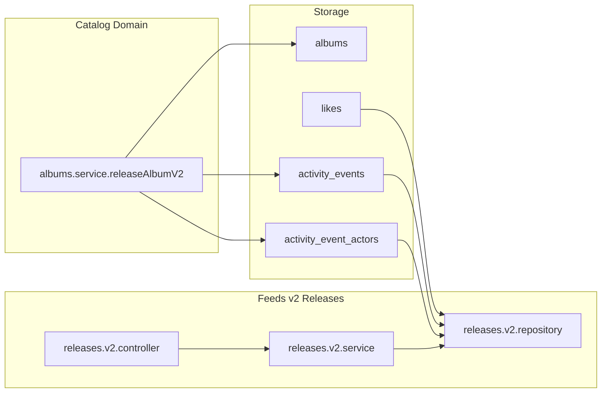

## Goal

Implement **feeds v2 – releases** backed by a centralized `activity_events` table so that release feeds are powered by a single global event log instead of per-read CQRS tables, starting with album releases. This is a good next step because it keeps writes simple, unifies future event use cases across domains, and still allows you to evolve into projections later if needed.

## High-level design

- **Storage**
  - `**activity_events**`: canonical system activity table (event envelope).
    - Columns (matching the design doc):
      - `event_id CHAR(36) PRIMARY KEY` – unique event id (UUID).
      - `occurred_at TIMESTAMP NOT NULL` – when the business event happened.
      - `event_domain VARCHAR(32) NOT NULL` – domain emitting the event, e.g. `catalog`, `player`, `social`.
      - `event_type VARCHAR(64) NOT NULL` – exact event name, e.g. `catalog.album_released`.
      - `aggregate_type VARCHAR(32) NOT NULL` – changed business object type, e.g. `album`, `episode`, `track`, `like`.
      - `aggregate_id CHAR(36) NOT NULL` – changed business object id.
      - `payload_json JSON NOT NULL` – event-specific snapshot data (see examples below).
      - `schema_version INT NOT NULL DEFAULT 1` – payload version.
      - `created_at TIMESTAMP NOT NULL DEFAULT CURRENT_TIMESTAMP` – when the row was written.
    - Indexes tuned for reads:
      - `idx_activity_events_occurred_at (occurred_at DESC)` – chronological feeds.
      - `idx_activity_events_type_time (event_domain, event_type, occurred_at DESC)` – query by event kind.
      - `idx_activity_events_aggregate (aggregate_type, aggregate_id, occurred_at DESC)` – query by object.
  - `**activity_event_actors**` (optional): actors / owners per event.
    - Columns:
      - `event_id CHAR(36) NOT NULL` FK → `activity_events(event_id)`.
      - `actor_type VARCHAR(32) NOT NULL` – `artist`, `show`, `user`, etc.
      - `actor_id CHAR(36) NOT NULL`.
      - `actor_name VARCHAR(255) NOT NULL`.
      - PK `(event_id, actor_id)`.
    - Indexes:
      - `idx_activity_event_actors_actor (actor_type, actor_id, event_id DESC)` – “events for this actor/owner”.
  - **Relationship to existing tables**
    - Keep existing domain tables (`albums`, `album_artists`, `likes`, etc.) as source of truth.

## Scope confirmation (what this v2 does now)

- **Yes, this v2 is the right next step** given your current scale and goals:
  - It **centralizes events** from multiple domains without forcing you into complex CQRS workers yet.
  - It **reuses one schema** (`activity_events` + `activity_event_actors`) for future features (play history, likes feed, etc.).
  - Reads are still a single SQL query using existing `likes` and artist relations, and can later be specialized via projections if needed.
  - You keep v1 and current v2/v3 paths in place, so risk is limited and rollbacks are trivial.
- **Out of scope for this iteration**
  - Episode releases, track played, track liked events – only design them implicitly through schema flexibility.
  - Background workers / projections – reads will hit `activity_events` directly.

## Changes – DB schema (`REAME/scripts/db_schema.md`)

- **Add `activity_events` table** after existing event/feed tables section for clarity.
  - Implement columns exactly as in the activity-events design doc:
    - `event_id, occurred_at, event_domain, event_type, aggregate_type, aggregate_id, event_payload_json, schema_version, created_at`.
  - Ensure engine is `InnoDB` and charset matches existing tables.
  - Document column meaning in comments, following the style already used (short explanation blocks above tables).
  - Add indexes:
    - `idx_activity_events_occurred_at (occurred_at DESC)`.
    - `idx_activity_events_type_time (event_domain, event_type, occurred_at DESC)`.
    - `idx_activity_events_aggregate (aggregate_type, aggregate_id, occurred_at DESC)`.
- **Add `activity_event_actors` table** mirroring the doc.
  - Columns: `event_id, actor_type, actor_id, actor_name`.
  - Primary key `(event_id, actor_id)` and FK with `ON DELETE CASCADE` to `activity_events`.
  - Index `idx_activity_event_actors_actor (actor_type, actor_id, event_id DESC)` for actor‑centric queries.
- **Optional seed data**
  - For dev convenience, backfill a small number of album release events from current `albums` and `album_artists` into `activity_events`/`activity_event_actors`, with `event_domain = 'catalog'`, `event_type = 'catalog.album_released'`, and `aggregate_type = 'album'`.
  - Build `payload_json` in the same shape as the album-released example (releasedAt, album, owners).
  - Keep seed comments explicit so it’s clear this is demo data.

## Changes – albums release v2 writer

- `**albums.service.ts**`
  - Introduce a new method, e.g. `releaseAlbumV2` (name aligned with the centralized activity_events design; keep existing `releaseAlbum` and `releaseAlbumV3` methods untouched for now).
    - Responsibilities (all done **inside a single DB transaction**):
      - Update `albums.released_at = NOW()` via `albums.repository.releaseAlbumById`.
      - If no row updated → throw `NotFoundError` and roll back.
      - Fetch album details using `getAlbumDetails` (returning `AlbumDetails`, which includes album core fields plus artists).
      - Build a normalized event payload for an album release from `AlbumDetails`.
      - Call a new helper (see below) so that inserting into `activity_events` and `activity_event_actors` happens in the **same transaction** as the album update.
- **Event mapping for album release**
  - `event_domain` = `"catalog"`.
  - `event_type` = `"catalog.album_released"`.
  - `aggregate_type` = `"album"`.
  - `aggregate_id` = `albumId`.
  - `occurred_at` = `releasedAt` (the time we mark the album released).
  - `schema_version` = `1`.
  - The **payload type** for `payload_json` is owned by the catalog domain
    (e.g. `catalog_events/albums/AlbumReleasedEventPayload`). Activity-events just
    stores that payload in `activity_events.payload_json` and exposes generic
    read/write helpers for it.
  - For each artist in the payload we also insert a row into `activity_event_actors`
    with `actor_type = 'artist'`, `actor_id = artist.id`, `actor_name = artist.name`.
- **New activity-events module (service + repository)**
  - Add a dedicated `activityEvents` domain module under `serverWorkspace/app-rest-api/src/modules/activityEvents/` with:
    - `activityEvents.repository.ts` – low-level DB access for `activity_events` and `activity_event_actors`.
    - `activityEvents.service.ts` – higher-level write APIs used by other domains.
  - In `activityEvents.service.ts`, expose `insertAlbumReleaseEventToActivityEvents` (and design it so future event types can reuse the same infrastructure).
    - Implementation details:
      - Accept a typed input (album id/name/type/image, release time, list of artists).
      - Generate `event_id` with `crypto.randomUUID()`.
      - Begin a DB transaction:
        - Insert into `activity_events` with `verb = 'released'`, `object_type = 'album'`, `object_id = albumId`, and `event_data` JSON containing album_type, image_url, etc.
        - Insert batch rows into `activity_event_actors` for each artist (`actor_type = 'artist'`).
      - Commit on success; rollback on error.
      - Log SQL and params via existing `logger` pattern.
- **Wiring**
  - Any admin/dev route that currently calls `releaseAlbum` or `releaseAlbumV3` can be extended or toggled to call `releaseAlbumV2` for this experiment (plan notes can specify whether you want a flag or a straight replacement once v2 is verified).

## Changes – feeds v2 releases API (reader)

- **New module structure (no code sharing with v1)**
  - Create `serverWorkspace/app-rest-api/src/modules/feeds/v2/releases/` as a **fully separate module**; do **not** import or reuse v1 code.
    - `releases.router.v2.ts`
    - `releases.controller.v2.ts`
    - `releases.service.v2.ts`
    - `releases.repository.v2.ts`
    - `types/` – v2-specific copies of the v1 models/schemas (e.g. `QueryReleaseFeedInputV2`, `QueryReleaseFeedInputSchemaV2`, `ReleaseFeedOutputV2`), even if they are structurally identical.
- **Routing**
  - Add a v2 route, e.g. `GET /api/feeds/v2/releases` (exact path matching your router conventions):
    - Wire to `getReleaseFeedsV2` controller, which:
      - Extracts `userId` from `requestContext`.
      - Uses the **v2-specific query schema** (`QueryReleaseFeedInputSchemaV2`) so that v2 can evolve independently from v1.
- **Service layer**
  - Implement `getReleaseFeedsV2(userId, query)` in `releases.service.v2.ts`:
    - Use only the v2 types (`ReleaseFeedOutputV2`, `ReleaseFeedItemV2`).
    - Preserve the v1 behavior that `release_episode` is not implemented yet by validating `event_type` similarly, or constrain v2 to `release_album` only for now.
    - Delegate to `releases.repository.v2.getReleaseFeedsV2`.
- **Repository – SQL redesign**
  - Implement `getReleaseFeedsV2(userId, query)` in `releases.repository.v2.ts`.
    - Strategy:
      - Start from liked artists for the current user (same as v1):
        - `likes l` filtered by `l.user_id = ?`, `l.entity_type = 'artist'`, `l.deleted_at IS NULL`.
      - Join to `activity_event_actors` to find events for those artists:
        - `JOIN activity_event_actors aea ON aea.actor_type = 'artist' AND aea.actor_id = l.entity_id`.
      - Join to `activity_events ae`:
        - Filter by `ae.event_domain = 'catalog'` and `ae.event_type = 'catalog.album_released'`.
        - Filter by `ae.occurred_at >= NOW() - INTERVAL ? DAY` (or `CURDATE() - INTERVAL ? DAY`, consistent with v1).
        - Apply cursor pagination based on `(occurred_at, event_id)` similar to the existing `released_at` + `id` pattern in v1.
      - Optionally join back to `albums` / `album_artists` / `artists` if you want stronger consistency or extra fields; for the first iteration, rely on denormalized fields in `payload_json` + `activity_event_actors` to avoid extra joins.
      - Use a CTE `page_events` similar to `page_albums` for pagination.
    - Map rows to `ReleaseFeedItem[]`:
      - Group by `aggregate_id` (album id) and dedupe actors exactly as v1 does.
      - `feedVerb = 'released'`.
      - `feedObject` built from `payload_json.album` (title, imageUrl, albumType).
      - `occurredAt` = `ae.occurred_at.toISOString()`.
      - Build `cursor` using an encode/decode helper analogous to the existing base64url cursor, but based on `occurred_at` + `event_id`.
- **Types reuse**
  - Reuse `QueryReleaseFeedInput`, `QueryReleaseFeedInputSchema`, and `ReleaseFeedOutput` from v1 `types` via barrel imports.
  - If needed, add a v2‑specific cursor type inside the v2 repository file (private to that module).

## Integration & compatibility

- **App entrypoint wiring**
  - Update `app.ts` to register the new v2 router under the appropriate base path while keeping v1 routes.
  - Ensure route ordering doesn’t shadow existing paths.
- **Backwards compatibility**
  - Keep existing v1 `GET /feeds/v1/releases` (or equivalent) untouched.
  - Initially, expose v2 as an opt‑in endpoint; once stable, the client can switch over and v1 can be deprecated.

## Testing & validation

- **Unit / integration tests**
  - Add repository tests for `getReleaseFeedsV2` covering:
    - Multiple liked artists, multiple events.
    - Albums with multiple artists.
    - `days` filter.
    - Pagination with cursor.
  - Add service tests verifying `BadRequestError` behavior for unsupported event types (if you keep that behavior).
  - Add an integration test (or manual script) to:
    - Call the admin endpoint that triggers `releaseAlbumV2` for a known album.
    - Verify `activity_events` + `activity_event_actors` rows exist.
    - Verify `GET /feeds/v2/releases` returns that album in the feed for a user who likes the artist.
- **Performance sanity check**
  - Ensure `EXPLAIN` on the main v2 query shows proper use of `idx_activity_event_actors_actor` and `idx_activity_events_event_time`.
  - Validate that `LIMIT + 1` pagination and cursor encoding behave the same as in v1.

## Migration / rollout strategy

- **DB migration**
  - Apply updated `db_schema.md` to dev/local first; for higher environments, translate into your migration tooling if applicable.
- **Feature rollout**
  - Expose v2 endpoint alongside v1 and test with mock or dev clients.
  - Once v2 behavior is validated, switch the UI/feed consumer to v2 and keep v1 as fallback for one more iteration.
  - Later, consider adding dedicated projection tables derived from `activity_events` if you need more specialized feeds.

