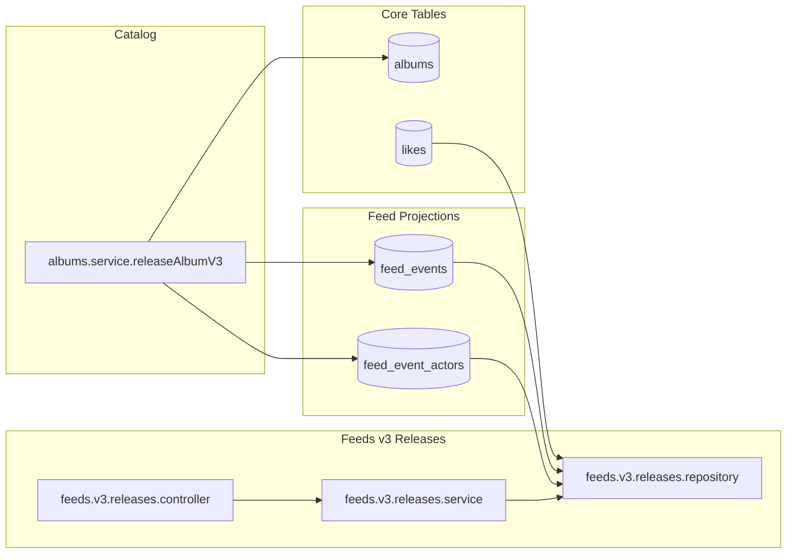

### Goal

Update `_plans/uc00012-backend-whats-new-feed-v3-direct-projection-writes.plan.md` so that it clearly describes **Version 3 – Monolith with Direct Projection Writes** for:

- **Album release write path**: albums module writes to both source tables and feed projection tables in the same transaction.
- **Feeds v3 releases read path**: feeds v3 module reads directly from `feed_events` + `feed_event_actors` projection tables.
- **Coexistence**: keep the existing v2 `activity_events` design documented separately; v3 is a parallel, more opinionated CQRS-projection version.

### Plan structure for the updated V3 plan file

- **Front‑matter metadata**
  - Update `name` to something like `feed-v3-direct-projection-writes`.
  - Update `overview` to explain that V3 adds dedicated `feed_events` + `feed_event_actors` projection tables and a write path that updates them synchronously during album release, plus a feeds v3 releases API that reads from these projections.
  - Replace `todos` with a small, focused list of work items for V3 (DB schema, writer wiring from albums, feeds v3 reader module, migration/testing).
- **Section 1 – Architecture (Version 3 overview)**
  - Add a short textual description matching your screenshot:
    - Keep source tables (`albums`, `album_artists`, `likes`).
    - Add **dedicated read / projection tables** per read domain (`feed_events`, `feed_event_actors` for releases feed).
    - Perform **write path updates directly into projection tables in the same transaction** as the domain write (no workers / pipelines yet).
  - Add a `mermaid` diagram capturing:

- **Section 2 – Storage: feed projection tables**
  - Describe the **canonical projection tables** for feeds v3, aligned with your design doc:
    - `feed_events` – canonical feed projection table.
      - Columns (matching the doc): `event_id`, `event_time`, `event_type` (verb), `object_type`, `object_id`, `object_name`, `object_image_url`, `payload_json`, `created_at`.
      - Typical `event_type`: `release_album`, `release_episode`, `track_liked` (even if only `release_album` is used now).
      - Typical `object_type`: `album`, `episode`, `track`.
      - Indexes tuned for reads and pagination, e.g. `(event_time DESC)`, `(event_type, event_time DESC)`, `(object_type, object_id, event_time DESC)`.
    - `feed_event_actors` – many‑to‑many mapping of events → actors.
      - Columns: `event_id`, `actor_id`, `actor_type`, `actor_name`.
      - Used for:
        - albums with many artists.
        - follow‑based matching (liked artists → events).
      - PK `(event_id, actor_id)` and index `(actor_type, actor_id, event_id DESC)`.
  - Point to the concrete schema location in `[serverWorkspace/REAME/scripts/db_schema.md](serverWorkspace/REAME/scripts/db_schema.md)` and specify that V3 adds or updates the DDL there with idempotent `DROP TABLE IF EXISTS` followed by `CREATE TABLE` for these two tables.
- **Section 3 – Write path: release album → projection tables**
  - Describe the V3 write path as a **single transaction** that updates both source and projection tables:
    - Entry: `POST /albums/:albumId/release/v3` (or reuse `/release/v2` but plan will treat it as V3 semantics) wired into `albums.router` and `albums.controller`.
    - Service: `albums.service.releaseAlbumV3` (or equivalent) that:
      - Marks the album as released in `albums` (reusing existing `releaseAlbumById` or similar repository method).
      - Loads album + artist details (from `albums.repository` helper like `getAlbumWithArtistsForRelease`).
      - Generates `eventId = crypto.randomUUID()` and `releasedAt = new Date()`.
      - Calls the **feeds v3 writer** module to insert an album release event into `feed_events` + `feed_event_actors` using those details.
    - Ensure the plan explicitly states that **both the album update and the feed projection inserts happen in the same DB transaction**, so the projection stays in sync without workers.
  - Reference existing writer code you already have under `[serverWorkspace/app-rest-api/src/modules/feeds/v3/writer](serverWorkspace/app-rest-api/src/modules/feeds/v3/writer)`:
    - `feeds-events.repository.ts` with `insertAlbumReleaseEvent` that writes to `feed_events` and `feed_event_actors`.
    - `feeds-events.service.ts` and `index.ts` that expose `insertAlbumReleaseEvent` and `AlbumReleaseEventParams`.
  - Spell out what the album service needs to pass into `AlbumReleaseEventParams` (matching the existing TypeScript interface): `eventId`, `releasedAt`, `artists[]`, `albumId`, `albumName`, `albumType`, `imageUrl`, and optional context object fields.
- **Section 4 – Read path: feeds v3 releases API (projection tables)**
  - Define a new **feeds v3 releases module** instead of reusing v2, to keep separation clear (as you requested):
    - Folder: `serverWorkspace/app-rest-api/src/modules/feeds/v3/releases/`.
    - Files:
      - `releases.router.ts`.
      - `releases.controller.ts`.
      - `releases.service.ts`.
      - `releases.repository.ts`.
      - `types/` – v3 copies of the v1/v2 input/output models (e.g. `QueryReleaseFeedInputV3`, `QueryReleaseFeedInputSchemaV3`, `ReleaseFeedOutputV3`), even if identical for now.
  - **Endpoint**: `GET /me/feeds/v3/releases` with the same query params and JSON shape as v2, but implemented purely against projection tables.
  - **Repository SQL design** against `feed_events` + `feed_event_actors`:
    - Start from liked artists:
      - `likes l` filtered by `user_id = ?`, `entity_type = 'artist'`, `deleted_at IS NULL`.
    - Join to `feed_event_actors`:
      - `JOIN feed_event_actors fea ON fea.actor_type = 'artist' AND fea.actor_id = l.entity_id`.
    - Join to `feed_events fe`:
      - Filter by `fe.event_type = 'release_album'` and `fe.object_type = 'album'`.
      - Apply `days` filter using `fe.event_time >= CURDATE() - INTERVAL ? DAY`.
      - Apply cursor pagination based on `(fe.event_time, fe.event_id)` similar to v1/v2.
    - Optionally group by `fe.object_id` (album id) and aggregate distinct actors per album; build response items using denormalized fields from `feed_events` + actor names from `feed_event_actors`.
    - Use `LIMIT (pageSize + 1)` plus a base64url cursor `{ eventTime, eventId }`.
  - Clarify that **no joins to activity_events** are used in v3; reads hit projection tables only.
- **Section 5 – Files to create / change for V3**
  - Summarize required file work so this plan is actionable:
    - `serverWorkspace/REAME/scripts/db_schema.md`
      - Add or refine `feed_events` and `feed_event_actors` table definitions plus indexes.
    - `serverWorkspace/app-rest-api/src/modules/feeds/v3/writer/` (existing)
      - Confirm and, if needed, adjust `insertAlbumReleaseEvent` to match final schema (column names, types, indexes) and logging style.
    - `serverWorkspace/app-rest-api/src/modules/catalog/albums/albums.service.ts`
      - Add `releaseAlbumV3` (or adapt the existing release method) to call feeds v3 writer with `AlbumReleaseEventParams`.
    - `serverWorkspace/app-rest-api/src/modules/catalog/albums/albums.controller.ts` & `albums.router.ts`
      - Add `POST /albums/:albumId/release/v3` (or wire V3 semantics to your chosen route) and delegate to the new service method.
    - `serverWorkspace/app-rest-api/src/modules/feeds/v3/releases/`
      - Create router, controller, service, repository, and types for `GET /me/feeds/v3/releases`.
    - `serverWorkspace/app-rest-api/src/app.ts`
      - Register the feeds v3 releases router alongside existing v1/v2 routes.
- **Section 6 – Coexistence with v1/v2 and migration notes**
  - Document that:
    - v1 remains as is (legacy path).
    - v2 continues to use `activity_events` for experimentation and as a generic event log.
    - v3 is a **projection‑oriented path** optimized for the releases feed, directly updated from the monolith.
  - Outline a simple rollout plan:
    - Implement and backfill `feed_events` + `feed_event_actors` for album releases (optional small seed script).
    - Expose v3 endpoint `/me/feeds/v3/releases` next to v2.
    - Compare responses between v2 and v3 in tests.
    - Once stable, clients can switch from v2 to v3 while keeping v2 available as a fallback.
- **Section 7 – Testing checklist**
  - Add a concise checklist rather than full test specs:
    - Album release writes create rows in `feed_events` and `feed_event_actors` with correct data.
    - `GET /me/feeds/v3/releases` returns expected items for users with liked artists.
    - Pagination and `days` filters behave like v2.
    - v1 and v2 endpoints still work unchanged.

This plan keeps the V3 plan file focused on the **direct projection write** architecture, explicitly documents the new projection tables and read/write paths, and clearly separates it from the existing v2 `activity_events` design while allowing both to coexist during rollout.