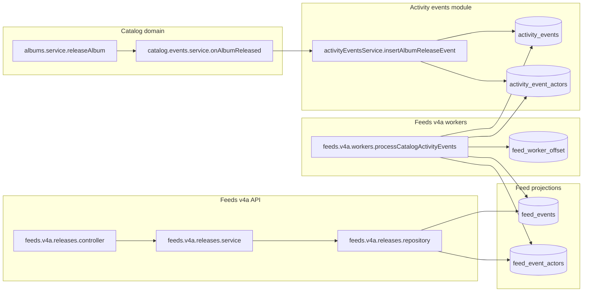

## UC00012 – Backend what’s-new feed v4a (activity log + workers)

---
 title: UC00012 – Backend what’s-new feed v4a (activity log + workers)
 status: planned
---

## Use case

**UC00012 – Get "what’s new" feed of latest releases.**  
Same user-facing behavior as earlier versions: a logged-in user opens the home or "What’s new" screen and receives a feed of recently released albums (and, later, podcast episodes) **only for artists/shows that the user has liked**.

The difference in v4a is **how** the feed data is produced:

- Catalog domain writes **domain events** into a shared `activity_events` + `activity_event_actors` schema.
- A **feeds v4a worker** reads the activity log, using `feed_worker_offset` to track progress, and **projects** those events into dedicated `feed_events` + `feed_event_actors` tables.
- The **feeds v4a API** reads only from the feed projection tables, not from catalog tables directly.

## UC00013 – POST album release (write path) – v4a semantics

**UC00013 – Mark an album as released and emit a catalog activity event.**  
Admin/dev uses `POST /albums/:id/release` to set `albums.released_at = NOW()` and, in v4a semantics, the catalog module also emits a `catalog.album_released` event into the shared activity log.

**Specification (HTTP)**

- **Endpoint**: `POST /albums/:id/release` (same external contract as earlier versions; v4a changes the internal write behavior).
- **Access**: dev/admin (requires admin role).
- **Body**: none (simple release-now).
- **Responses**: 204 No Content (success), 400 (invalid UUID), 404 (album not found), 401/403 (unauthorized / not admin).

**Write path responsibilities**

1. **albums.service.releaseAlbum** (catalog domain)
   - Validate request and permissions.
   - In a DB transaction, update `albums.released_at = NOW()` for the target album.
   - Load album + artists details needed for the event payload.
   - Generate a new `eventId` (e.g. UUID).
   - Build a `AlbumReleasedEventPayload` object owned by the catalog domain.
   - Call `catalog.events.service.onAlbumReleased(conn, eventId, payload)`.

2. **catalog.events.service.onAlbumReleased**
   - Lives in `catalog/_events/catalog.events.service.ts`.
   - Knows how to map catalog-specific payload types (e.g. `AlbumReleasedEventPayload`) into the shared activity log envelope.
   - Delegates to `activityEventsService.insertAlbumReleaseEvent(conn, eventId, payload)` for persistence.

3. **activityEventsService.insertAlbumReleaseEvent**
   - Lives in `activityEvents/activityEvents.service.ts`.
   - Writes one row into `activity_events` (envelope + payload JSON).
   - Writes one or more rows into `activity_event_actors` for participating artists.
   - Executes within the same transaction provided by the caller.

The result: album-release writes are still **monolithic and transactional**, but they also produce a canonical activity event into the shared log that downstream consumers (like feeds v4a) can read.

## HLD: Architecture – monolith with workers

v4a moves the feed implementation toward a CQRS-style architecture while staying in a monolith and a single database.

- **Write model**
  - Catalog modules own tables like `albums`, `album_artists`, etc.
  - On key state changes (e.g. album released), catalog writes its own tables and calls into the activityEvents module.
  - The activityEvents module owns `activity_events` + `activity_event_actors` and stores a canonical event envelope + domain-owned payload JSON.

- **Read model**
  - Feeds v4a owns `feed_events` + `feed_event_actors` as **projection tables** optimized for the what’s-new feed.
  - A feeds v4a worker reads from the activity log and populates these tables.
  - The feeds v4a HTTP API reads **only** from these projection tables.

- **Worker coordination**
  - A `feed_worker_offset` table tracks, per logical stream, which activity events have been processed.
  - Workers run inside the monolith (e.g. background job or CLI script) and share the same DB.

### Architecture diagram (conceptual)

## Storage: activity log, feed projections, worker offsets

### Activity log tables (owned by activityEvents)

- `activity_events`
  - Canonical event envelope + domain payload JSON.
  - Important columns:
    - `event_id` (PK or unique) – stable id for deduplication/idempotency.
    - `event_domain` – e.g. `catalog`.
    - `event_type` – e.g. `album_released`.
    - `aggregate_type` – e.g. `album`.
    - `aggregate_id` – e.g. album id.
    - `occurred_at` – event time (from domain).
    - `schema_version` – payload schema version.
    - `event_payload_json` – serialized `AlbumReleasedEventPayload`.
    - `created_at`.

- `activity_event_actors`
  - Many-to-many mapping between events and actors (artists, shows, etc.).
  - Important columns:
    - `event_id` (FK to `activity_events`).
    - `actor_type` – e.g. `artist`, `show`.
    - `actor_id`.
    - `actor_name`.

These tables are the **single source of truth** for cross-domain activity, including feed-related events.

### Feed projection tables (owned by feeds)

- `feed_events`
  - Projection table for feed items.
  - Suggested important columns:
    - `id` or `feed_event_id` (PK).
    - `activity_event_id` (FK-like reference back to `activity_events.event_id` for traceability).
    - `event_time` – copied from `activity_events.occurred_at`.
    - `event_type` – e.g. `release_album`.
    - `object_type` – e.g. `album`.
    - `object_id` – e.g. album id.
    - `object_name` – e.g. album title.
    - `object_image_url`.
    - `payload_json` (optional) – projection-specific payload.
    - `created_at`.
  - Indexes:
    - `(event_time DESC, id ASC)` for feed scrolling.
    - `(event_type, event_time DESC)` if needed.
    - Unique constraint on `activity_event_id` to make worker idempotent.

- `feed_event_actors`
  - Projection of feed actors, parallel to `activity_event_actors` but tailored for feed reads.
  - Suggested columns:
    - `feed_event_id` (or `activity_event_id` if you choose that as the key).
    - `actor_type`.
    - `actor_id`.
    - `actor_name`.
  - Indexes:
    - `(actor_type, actor_id, feed_event_id DESC)` for queries like "events for liked artists".

### Worker offset table (owned by feeds)

- `feed_worker_offset`
  - Tracks how far each worker/stream has processed the activity log.
  - Columns:
    - `source_stream` (PK) – logical stream name, e.g. `"feeds_v4a_catalog"`.
    - `last_event_id` (nullable initially) – last successfully processed event id.
    - `last_occurred_at` (nullable) – event time of the last processed event.
    - `updated_at` – last time this row was updated.
  - Semantics:
    - One row per worker stream (e.g. catalog → feeds v4a).
    - Worker uses `(last_occurred_at, last_event_id)` as a cursor into `activity_events`.
    - Monitoring can check `NOW() - updated_at` to detect stuck workers.

## Worker design: feeds v4a workers

### Responsibilities

- Periodically poll `activity_events` / `activity_event_actors` for new events relevant to feeds.
- Transform those activity events into feed projection records.
- Write to `feed_events` + `feed_event_actors` in an idempotent way.
- Advance `feed_worker_offset` only after successful projection writes.

### Processing loop (per worker)

For a given logical stream (e.g. `"feeds_v4a_catalog"`):

1. **Load offset**
   - Read the `feed_worker_offset` row for the stream.
   - If none exists, start from a configured initial point (e.g. no filter / min date).

2. **Fetch a batch of new activity events**
   - Query `activity_events` with filters:
     - `event_domain = 'catalog'`.
     - `event_type = 'album_released'` (initially).
   - Apply cursor:
     - If offset exists, select events where `(occurred_at, event_id) > (last_occurred_at, last_event_id)`.
   - Order by `occurred_at ASC, event_id ASC`.
   - Limit by batch size (e.g. 100 or 1000).

3. **Join actors**
   - For the selected `event_id`s, fetch `activity_event_actors` rows.
   - Group by `event_id` to obtain the list of artists/actors per event.

4. **Build feed projections**
   - For each activity event:
     - Map envelope + payload to a `feed_events` row (id, object fields, event_time, etc.).
     - Map associated actors to `feed_event_actors` rows.

5. **Write projections and update offset (transactional)**
   - Within a DB transaction:
     - Insert or upsert into `feed_events`:
       - Use `activity_event_id` to enforce uniqueness; on conflict, either skip or update.
     - Insert or upsert into `feed_event_actors` for each actor.
     - Update `feed_worker_offset`:
       - Set `last_event_id` and `last_occurred_at` to the last successfully processed event from the batch.
       - Set `updated_at = NOW()`.
   - If anything fails, roll back the transaction and do **not** advance the offset; the batch will be retried.

6. **Repeat**
   - If batch size was full, there might be more events; loop again until no more new events or until a time/batch budget is exhausted.

### Idempotency and error handling

- **Idempotency**
  - Unique constraint on `feed_events.activity_event_id`.
  - Worker inserts with `INSERT IGNORE` / upsert semantics; reprocessing the same event is safe.
- **Partial failures**
  - Because projection writes and offset updates happen in one transaction, either:
    - All events in the batch are projected and offset advances, or
    - None are, and they will be retried.
- **Monitoring**
  - Track:
    - `NOW() - last_occurred_at` per stream (lag).
    - `NOW() - updated_at` (health).
    - Error counts and retries.

## Feeds v4a read API (projections)

### Endpoint

- **Method**: `GET`
- **Path**: `/me/feeds/v4a/releases` (or similar; v4-specific path to avoid confusion).
- **Description**: Return a personalized "what’s new" feed of latest releases, backed purely by `feed_events` + `feed_event_actors` projections built by the workers.

### Query params

Reuse the established shape (adapted to v4a naming), for example:

- `event_type` – optional filter, values like `"release_album"` (later `"release_episode"`).
- `days` – optional look-back window in days (e.g. default 60, min 1, max 90), applied to `feed_events.event_time`.
- `limit` – optional page size (e.g. default 10, max 150).
- `cursor` – optional opaque cursor encoding `(event_time, activity_event_id)` for keyset pagination.

### Behavior

- Start from the current user’s liked artists in `likes`.
- Join liked artists to `feed_event_actors` where `actor_type = 'artist'` and `actor_id` in liked artists.
- Join matched actors to `feed_events` where:
  - `feed_events.event_type = 'release_album'`.
  - `feed_events.event_time` is within the `days` window.
- Apply cursor filter using `(event_time, activity_event_id)` for keyset pagination.
- Sort by `event_time DESC, activity_event_id ASC`.
- Group rows by `activity_event_id` (or `feed_event_id`) to form feed items with:
  - `feedActors` – list of actors.
  - `feedVerb` – `"released"`.
  - `feedObject` – album metadata.
  - `occurredAt` – `feed_events.event_time`.
- Return `{ items, nextCursor? }`.

### Module structure

- `feeds/v4a/releases/types/` – v4a-specific input/output models and query schemas.
- `feeds/v4a/releases/releases.repository.ts` – SQL over `feed_events` + `feed_event_actors` + `likes`.
- `feeds/v4a/releases/releases.service.ts` – business logic and branching by `event_type`.
- `feeds/v4a/releases/releases.controller.ts` – HTTP wiring.
- `feeds/v4a/releases/releases.router.ts` – router mounted under `/me/feeds/v4a`.

## Entry points & file structure summary

Under `serverWorkspace/app-rest-api/src/modules/`:

- **Catalog**
  - `catalog/_events/catalog.events.service.ts`
    - `onAlbumReleased(conn, eventId, payload: AlbumReleasedEventPayload): Promise<void>`.
  - `catalog/albums/albums.service.ts`
    - Calls `onAlbumReleased` as part of `releaseAlbum` transaction.

- **ActivityEvents**
  - `activityEvents/activityEvents.service.ts`
    - `insertAlbumReleaseEvent(conn, eventId, payload)` that writes to `activity_events` + `activity_event_actors`.

- **Feeds v4a workers**
  - `feeds/v4a/workers/*`
    - Worker config and types (e.g. batch size, stream names).
    - Worker implementation that:
      - Loads `feed_worker_offset`.
      - Queries `activity_events` + `activity_event_actors`.
      - Writes `feed_events` + `feed_event_actors`.
      - Updates `feed_worker_offset`.

- **Feeds v4a API**
  - `feeds/v4a/releases/*`
    - Controller, service, repository, types, router for `GET /me/feeds/v4a/releases`.

## Rollout and coexistence

- v1 (join core) and v3 (direct projection writes) can remain in place for comparison or legacy paths.
- v4a adds:
  - A domain-agnostic activity log (`activity_events` / `activity_event_actors`) as the integration point.
  - A feeds v4a worker that consumes that log and maintains projections.
  - A v4a API that reads projections.
- Clients can gradually move to `/me/feeds/v4a/releases` once v4a projections have been backfilled and validated against previous versions.

## Testing checklist

- **Write path**
  - When an album is released, verify:
    - `albums.released_at` is set.
    - `activity_events` contains a `catalog.album_released` event with correct envelope and payload.
    - `activity_event_actors` contains rows for all participating artists.

- **Worker**
  - Starting from an empty `feed_worker_offset`, worker backfills existing relevant `activity_events` into `feed_events` + `feed_event_actors`.
  - Re-running the worker produces no duplicates thanks to `activity_event_id` uniqueness.
  - Offsets advance correctly and reflect the last processed event.

- **Read API**
  - `GET /me/feeds/v4a/releases` returns expected items for a user with liked artists.
  - `days`, `limit`, and `cursor` behave as specified.
  - Behavior matches legacy endpoints for overlapping scenarios.

