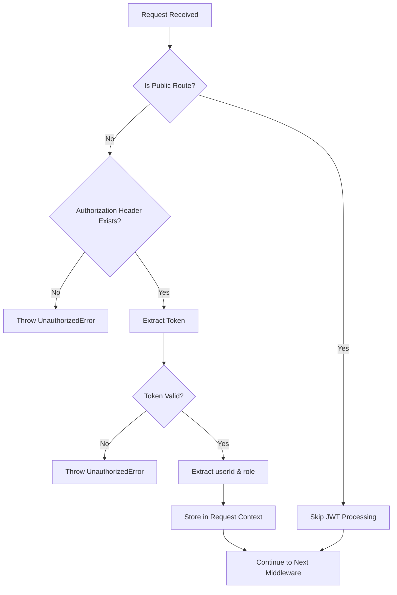

# 🔐 JWT Auth Middleware (Monolith Backend)

> **Operation Template**: Monolith → Microservices Architecture

---

## 📋 Version & Scope

**`V1`** = Simple JWT authentication middleware for monolith

| Feature | Status |
|---------|--------|
| ✅ Verifies JWT tokens from Authorization header | **Supported** |
| ✅ Stores user ID and role in request context | **Supported** |
| ✅ Supports public routes (skip authentication) | **Supported** |
| ❌ Refresh tokens | **Not Supported** |
| ❌ Sessions | **Not Supported** |
| ❌ Token rotation | **Not Supported** |
| ❌ Cookies | **Not Supported** |

---

## ✅ Prerequisites

Before implementing this middleware, ensure:

- ✅ Login operation is implemented (generates JWT tokens)
- ✅ `jsonwebtoken` library is installed
- ✅ `JWT_SECRET` environment variable is configured (min 32 chars)
- ✅ Request context utility is available
- ✅ Error handling middleware is in place

---

## 🚀 Quick Reference

| Item | Value |
|------|-------|
| **File Location** | `lib-common/src/app/express.middlewares/auth.monolith.jwt.middleware.ts` |
| **Registration** | `app.use(jwtAuthMiddleware({ publicRoutes: [...] }))` |
| **Environment** | `JWT_SECRET` (required), `JWT_ISSUER` (optional), `JWT_AUDIENCE` (optional) |

---

## 1️⃣ Operation Overview (HLD)

| Field | Value |
|-------|-------|
| **Operation Name** | JWT Auth Middleware (Monolith) |
| **Module (Domain)** | Infrastructure / Express Middlewares |
| **Future Microservice** | API Gateway / Auth Service |
| **User Type** | Infrastructure (runs on every request) |
| **Core Functionality?** | ✅ **Yes** |
| **Business Goal** | Verify JWT tokens from Authorization header and store user ID and role in request context for authenticated requests |

### 📝 HLD Notes

> This is infrastructure middleware that runs on every request.
> 
> - **In monolith**: Verifies JWT token and stores user info in context.
> - **In microservices**: API Gateway verifies token and adds `x-user-id` header; microservices read header.
> - **Architecture**: Middleware is framework-dependent (Express), but uses framework-agnostic request context.

---

## 2️⃣ Module Scope

**Module**: `lib-common/app/express.middlewares`

### ✅ Owns:
- JWT token verification
- User ID extraction from token
- User role extraction from token
- Request context population
- Public routes handling

### ❌ Does NOT:
- Generate tokens (handled by login operation)
- Validate user credentials (handled by login operation)
- Access database directly

### 🔮 Future:
- Becomes API Gateway middleware in microservices
- Microservices will use simpler middleware that reads `x-user-id` header

---

## 3️⃣ Files Involved (Monolith)

```
lib-common/src/app/express.middlewares/
 ├── auth.monolith.jwt.middleware.ts
 └── index.ts

lib-common/src/utils/request-context/
 └── request-context.util.ts

lib-common/src/domain/errors/
 └── error.types.ts
```

---

## 4️⃣ API Contract (LLD)

### 📄 File: `lib-common/src/app/express.middlewares/auth.monolith.jwt.middleware.ts`

```typescript
// Public Route Definition
export interface PublicRoute {
  method: string;
  path: string;
}

// Middleware Options
export interface JwtAuthMiddlewareOptions {
  publicRoutes?: PublicRoute[];
}

// JWT Payload Structure
interface JwtPayload {
  sub: string;        // Subject (user ID) - standard JWT claim
  email?: string;     // User email (optional)
  role?: string;      // User role (optional)
  iat?: number;       // Issued at
  exp?: number;       // Expiration
  iss?: string;       // Issuer
  aud?: string;       // Audience
}

// Middleware Function
export function jwtAuthMiddleware(
  options: JwtAuthMiddlewareOptions = {}
): (req: Request, res: Response, next: NextFunction) => void
```

### 💻 Usage Example

```typescript
app.use(jwtAuthMiddleware({
  publicRoutes: [
    { method: 'POST', path: '/users/register' },
    { method: 'POST', path: '/users/login' },
    { method: 'GET', path: '/health' }
  ]
}));
```

### 🌐 Example HTTP Call

```http
# Public route (no token required)
GET /health

# Protected route (token required)
GET /users/me
Authorization: Bearer <jwt-token>
```

---

## 5️⃣ Method Signatures

### 🔧 Middleware
**File**: `auth.monolith.jwt.middleware.ts`

```typescript
export function jwtAuthMiddleware(
  options: JwtAuthMiddlewareOptions = {}
): (req: Request, res: Response, next: NextFunction) => void
```

### 📦 Request Context
**File**: `request-context.util.ts`

```typescript
export function setUserId(userId: string): void;
export function getUserId(): string | undefined;
export function setUserRole(role: string): void;
export function getUserRole(): string | undefined;
```

---

## 6️⃣ Validation Rules

### 🔐 Middleware (Authentication Rules)

- ✅ Public routes: Skip JWT processing entirely
- ✅ Protected routes: Require Bearer token in Authorization header
- ✅ Token must be valid (not expired, not malformed)
- ✅ Token must contain `sub` claim (user ID)
- ✅ Token must contain `role` claim (user role)
- ✅ `JWT_SECRET` must be configured (minimum 32 characters)

### ⚠️ Error Handling

| Error Condition | Error Response |
|----------------|---------------|
| Missing token | `UnauthorizedError: "Authentication required. Bearer token not found in Authorization header."` |
| Invalid token | `UnauthorizedError: "Invalid token"` |
| Expired token | `UnauthorizedError: "Token has expired"` |
| Missing `sub` claim | `UnauthorizedError: "Token payload missing required 'sub' claim"` |
| Missing `role` claim | `UnauthorizedError: "Token payload missing required 'role' claim"` |

---

## 7️⃣ Database Usage

> **No direct database access.**
> 
> Middleware only verifies JWT tokens and extracts user info from token payload.
> 
> User data comes from token (created during login operation).

---

## 8️⃣ Service Logic Flow

**File**: `auth.monolith.jwt.middleware.ts`



### 📝 Step-by-Step Flow

1. **Check if current route is in `publicRoutes` list**
   - ✅ If match: Skip JWT processing, continue to next middleware
   - ❌ If no match: Continue to step 2

2. **Check if Authorization header exists and starts with `'Bearer '`**
   - ❌ If missing: Throw `UnauthorizedError`

3. **Extract token from Authorization header** (remove `'Bearer '` prefix)

4. **Get `JWT_SECRET` from environment variable**
   - ❌ If missing or < 32 chars: Throw Error

5. **Verify token using `jsonwebtoken.verify()`**
   - ❌ If expired: Throw `UnauthorizedError("Token has expired")`
   - ❌ If invalid: Throw `UnauthorizedError("Invalid token")`

6. **Extract user ID from `token.payload.sub`**

7. **Extract user role from `token.payload.role`**

8. **Store user ID in request context** via `requestContext.setUserId(userId)`

9. **Store user role in request context** via `requestContext.setUserRole(userRole)`

10. **Continue to next middleware**

---

## 9️⃣ Phase Task List (Bottom-Up)

| Step | Task | File / Method |
|------|------|---------------|
| **1** | Add `JWT_SECRET` to environment | `.env` |
| **2** | Install `jsonwebtoken` library | `lib-common/package.json` |
| **3** | Create JWT auth middleware | `auth.monolith.jwt.middleware.ts` |
| **4** | Implement public routes check | `jwtAuthMiddleware` function |
| **5** | Implement token extraction | `jwtAuthMiddleware` function |
| **6** | Implement token verification | `jwtAuthMiddleware` function |
| **7** | Implement context population | `requestContext.setUserId/setUserRole` |
| **8** | Register middleware in app | `app.ts` |
| **9** | Test with Postman | `-` |

---

## 🔟 Planning to Switch DB (Mongo)

> **No database changes needed.**
> 
> Middleware is stateless and only verifies JWT tokens.

---

## 1️⃣1️⃣ Planning to Split to Microservices

| Scenario | Monolith | Microservices |
|----------|----------|---------------|
| **Token Verification** | Middleware verifies JWT token | API Gateway verifies JWT token |
| **User Info Storage** | Stored in request context | API Gateway adds `x-user-id` and `x-role` headers |
| **Microservice Middleware** | N/A | Reads `x-user-id` and `x-role` from headers |
| **Request Context** | Same (framework-agnostic) | Same (framework-agnostic) |
| **Public Routes** | Handled by middleware | Handled by API Gateway |

---

## 1️⃣2️⃣ Testing Strategy

### 🧪 Unit Tests
- ✅ Test middleware function with valid token
- ✅ Test middleware function with invalid token
- ✅ Test middleware function with expired token
- ✅ Test middleware function with missing token
- ✅ Test public routes bypass
- ✅ Test context population (userId, userRole)

### 🔗 Integration Tests
- ✅ Test middleware with Express app
- ✅ Test middleware with error handler
- ✅ Test middleware with multiple routes

### 🎯 E2E Tests
- ✅ Test protected route with valid token (should succeed)
- ✅ Test protected route without token (should fail with 401)
- ✅ Test protected route with invalid token (should fail with 401)
- ✅ Test protected route with expired token (should fail with 401)
- ✅ Test public route without token (should succeed)

### 🔒 Security Tests
- ✅ Test token tampering (modified signature)
- ✅ Test token with wrong secret
- ✅ Test token with missing required claims (sub, role)
- ✅ Test middleware with malformed Authorization header

---

## 1️⃣3️⃣ Security Considerations

### 🔐 Token Security
- ✅ `JWT_SECRET` must be at least 32 characters (prevents brute force)
- ✅ `JWT_SECRET` should be stored in environment variables (never in code)
- ✅ Tokens should have short expiration times (recommended: 1 hour)
- ✅ Use HTTPS in production to prevent token interception

### 💬 Error Messages
- ✅ Generic error messages prevent information leakage
- ✅ "Invalid token" instead of "signature mismatch" or "malformed token"

### 🛣️ Public Routes
- ✅ Explicitly define public routes (secure by default)
- ✅ Review public routes regularly for security

### 🔮 Future Enhancements
- 🔄 Token blacklisting for logout
- 🔄 Rate limiting for authentication attempts
- 🔄 Token rotation support

---

## 1️⃣4️⃣ Performance Considerations

### ⚡ Middleware Overhead
- ✅ Public routes skip JWT processing (minimal overhead)
- ✅ Token verification is CPU-bound (consider caching for high traffic)
- ✅ Request context is in-memory (no I/O operations)

### 🚀 Optimization Tips
- ✅ Keep public routes list small and efficient
- 🔄 Consider token caching for frequently accessed tokens (future)
- ✅ Monitor middleware execution time in production

---

## 📌 Summary

This template is fully aligned with your Login User template and follows industry best practices for JWT authentication middleware in a monolith architecture.

---

## 🔜 Next Steps

**Next natural operation:**
- Get User Profile (Authenticated)
- Change Password
